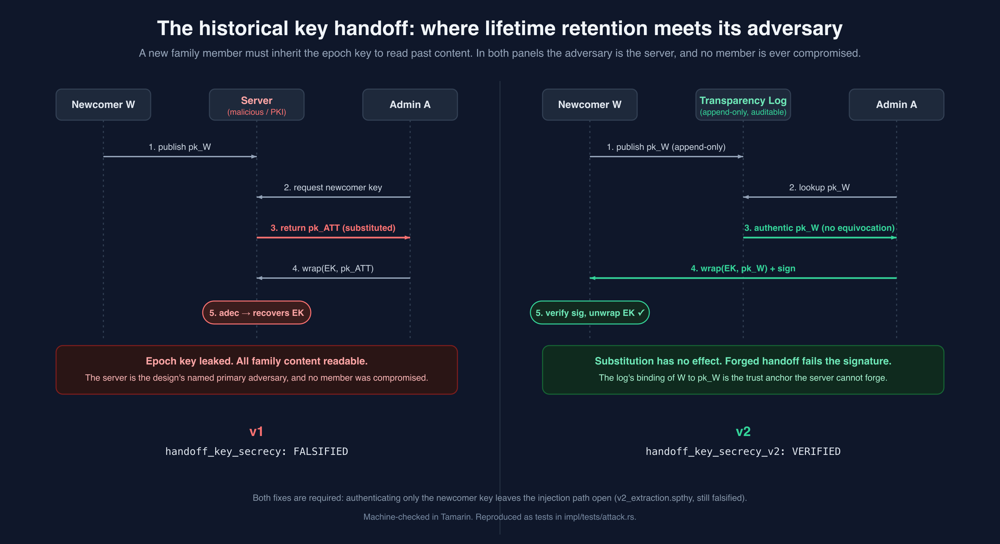

# Roots ZKA: a formal security analysis

Reconstructing the zero-knowledge encryption architecture designed for **Roots** (a lifetime family
photo-sharing app), stating its security goals as formal claims, and either proving them or breaking
them. Where the original design (**v1**) fails a claim, a strengthened design (**v2**) is proposed
and re-verified.

The encryption layer was fully designed and partially built, then deferred for market reasons before
the primitives were implemented for real. This repository does not ship it. It asks a narrower and
more interesting question: what did the design actually guarantee, where did it fail, and what does a
version that survives formal analysis look like?

## The headline

The analysis found a real key-substitution attack against the exact adversary the design named as
its primary threat: the server.

- The original documents claim "the server cannot impersonate users," while routing every public key
  through that same server with no out-of-band verification.
- Formal analysis turns that latent contradiction into a concrete trace. A malicious server
  substitutes its own key during member onboarding, the honest admin wraps the family key to the
  attacker, and all family content falls. No member is ever compromised.
- The underlying encryption construction is sound, verified two independent ways. The break is
  entirely in key distribution, not in the envelope.
- A v2 handoff (key-transparency log plus authenticated delivery) closes both the extraction and
  injection variants, machine-verified. A partial fix is proven insufficient, so the two-part fix is
  justified rather than asserted.

Every claim above is machine-checked: Tamarin for the protocol, a game-based reduction for the
encryption core, and a Rust reference implementation whose tests reproduce both the attack and its
fix.



## The idea worth remembering

Most end-to-end-encrypted systems are messaging systems, and messaging crypto is built around
**forward secrecy**: a new participant must not read old messages, and old keys are deleted as fast
as possible. Roots is the inverse. Its product promise is **lifetime retention**, so a family member
who joins in 2030 is supposed to inherit the entire history back to 2024. The protocol therefore
contains a mechanism, historical key distribution, whose whole job is to undo what forward secrecy
would otherwise enforce. Reasoning precisely about a system that deliberately inverts the central
guarantee of the protocols it borrows from is the intellectual core of this work.

## Results at a glance

Full table, traces, and reproduction commands in [`analysis/RESULTS.md`](analysis/RESULTS.md).

| Claim | Where | Verdict |
|---|---|---|
| Envelope confidentiality (content secret vs server, database, network) | `v1_core.spthy` + `proofs/ENVELOPE_ARGUMENT.md` | verified (two methods) |
| Revocation: a removed member cannot read later epochs | `v1_rotation.spthy` | verified |
| Bounded forward secrecy: epochs are independent | `v1_rotation.spthy` | verified |
| Recovery: mnemonic and password both unlock, secret otherwise | `v1_recovery.spthy` | verified |
| **v1 handoff key secrecy** | `v1.spthy` | **falsified (the attack)** |
| v1 handoff key injection (the dual attack) | `v1.spthy` | reachable (attack exists) |
| v2 handoff key secrecy | `v2.spthy` | verified (the fix) |
| v2 no key injection | `v2.spthy` | verified (the fix) |
| v2 partial fix (newcomer key only) | `v2_extraction.spthy` | falsified (both fixes needed) |

## Run it yourself

The fastest way to see the result is the reference implementation, where the v1 attack and the v2
defense are ordinary tests.

```
cd impl
cargo test          # 14 tests: standard KAT vectors, envelope obligations, v1 attack, v2 fix
```

`tests/attack.rs::v1_malicious_server_recovers_epoch_key` asserts the attack **succeeds** (the
malicious server recovers the family key); the v2 tests show the same adversary defeated. See
[`impl/README.md`](impl/README.md) for the test-to-proof map. Requires a recent stable Rust
(edition 2024 dependencies; tested on 1.96).

To re-check the proofs (requires `tamarin-prover` 1.12+):

```
tamarin-prover --prove model/v1_core.spthy                  # envelope confidentiality
tamarin-prover --prove model/v1_rotation.spthy              # revocation + forward secrecy
tamarin-prover --prove model/v1_recovery.spthy              # recovery
tamarin-prover --prove=handoff_key_secrecy model/v1.spthy   # the break (falsified)
tamarin-prover --prove model/v2.spthy                       # the fix (verified)
```

## Method

Layered, because no single tool covers all of it honestly.

| Layer | Tool | What it establishes |
|---|---|---|
| Protocol + membership state machine | Tamarin (symbolic, Dolev-Yao) | secrecy, authentication, and revocation over evolving epoch/membership state |
| Encryption core (DEK/KEK, AES-KW + AES-GCM) | game-based reduction, by hand | content confidentiality reduces to standard AEAD and key-wrap security |
| Reference implementation | Rust (`impl/`), 14 tests | primitives are the standard ones (known-answer vectors), the envelope obligations hold, and the attack and fix run as code |

## Repository layout

```
spec/      reconstructed v1 protocol spec + strengthened v2 spec
model/     Tamarin models (v1 broken, v2 fixed)
proofs/    game-based argument for the encryption core
impl/      Rust reference implementation and tests
analysis/  threat model, full results, attack traces, v2 rationale
assets/    diagrams of the key hierarchy and the handoff attack/fix
```

## Scope and honesty

This is an analysis artifact, not a product, and it is written to be honest about its own limits.

- The symbolic model is Dolev-Yao (perfect cryptography). It proves the protocol logic has no
  key-substitution trace; the separate game-based argument covers computational security of the
  encryption core.
- The handoff's ECDH-then-wrap is modelled as public-key encryption to the newcomer's key, a
  standard abstraction of the same trust relation that faithfully captures the unauthenticated-key
  attack. A full Diffie-Hellman-algebra model proves the same property but needs a custom proof
  oracle to terminate, which is noted as future work rather than a gap in the conclusion. Details in
  [`analysis/RESULTS.md`](analysis/RESULTS.md).
- In the original system the primitives were mocked on the client; only backend orchestration and
  the data model were built and tested. Claims in the original documents about "forward secrecy" and
  an "MLS-style tree" were aspirational relative to the flat per-member epoch-key wrapping that was
  actually designed. This repository analyzes the design as reconstructed, and flags where the
  reconstruction resolves an ambiguity ([`spec/PROTOCOL_V1.md`](spec/PROTOCOL_V1.md) §11).

Reconstructed from the original design documents (now archived). Contains no application code and no
secrets.
